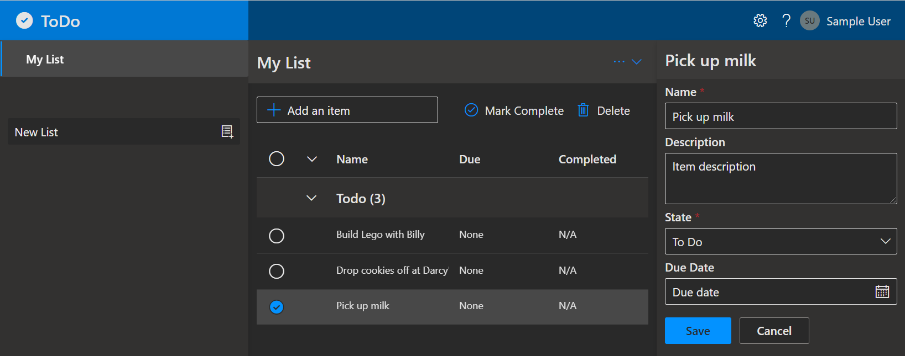

# Simple Web App with Node.js Frontend and Backend API using MongoDB

A React web app with a Node.js API and a MongoDB database running on Azure App Service. The application code (a ToDo web app) which can be removed and replaced with your own application code. Add your own source code and leverage the Infrastructure as Code assets (written in Bicep) to get up and running quickly.

Let's jump in and get this up and running in Azure. When you are finished, you will have a fully functional web app deployed to the cloud. In later steps, you'll see how to setup a pipeline and monitor the application.



<sup>Screenshot of the deployed ToDo app</sup>

### Prerequisites

The following prerequisites are required to use this application. Please ensure that you have them all installed locally.

- [Azure Developer CLI](https://aka.ms/azd-install)
- [Node.js with npm (18.17.1+)](https://nodejs.org/) - for API backend and Web frontend

### Quickstart
This quickstart will show you how to clone the repo, authenticate on Azure, initialize using a template, provision infrastructure and deploy code on Azure via the following commands:

```bash
# clone repository
git clone https://github.com/windramu/devops-challenge.git

# First-time project setup. Initialize a project in the current directory, enter unique environment name. 
cd devops-challenge 
azd init

# Log in to azd. Only required once per-install.
azd auth login --use-device-code --no-prompt

# Provision and deploy to Azure. URL of the Web App (Frontend and Backend API) will shown at the end of the process.
azd up

# Cleanup resources
#
azd down --purge --force
```

### Application Architecture

This application utilizes the following Azure resources:

- [**Azure App Services**](https://docs.microsoft.com/azure/app-service/) to host the Web frontend and API backend
- [**Azure Cosmos DB API for MongoDB**](https://docs.microsoft.com/azure/cosmos-db/mongodb/mongodb-introduction) for storage
- [**Azure Monitor**](https://docs.microsoft.com/azure/azure-monitor/) for monitoring and logging
- [**Azure Key Vault**](https://docs.microsoft.com/azure/key-vault/) for securing secrets

Here's a high level architecture diagram that illustrates these components. Notice that these are all contained within a single [resource group](https://docs.microsoft.com/azure/azure-resource-manager/management/manage-resource-groups-portal), that will be created for you when you create the resources.


> This template provisions resources to an Azure subscription that you will select upon provisioning them. Please refer to the [Pricing calculator for Microsoft Azure](https://azure.microsoft.com/pricing/calculator/) and, if needed, update the included Azure resource definitions found in `infra/main.bicep` to suit your needs.

### Application Code

This template is structured to follow the [Azure Developer CLI](https://aka.ms/azure-dev/overview). You can learn more about `azd` architecture in [the official documentation](https://learn.microsoft.com/azure/developer/azure-developer-cli/make-azd-compatible?pivots=azd-create#understand-the-azd-architecture).

### Next Steps

At this point, you have a complete application deployed on Azure. But there is much more that the Azure Developer CLI can do. These next steps will introduce you to additional commands that will make creating applications on Azure much easier. Using the Azure Developer CLI, you can setup your pipelines, monitor your application, test and debug locally.

> Note: Needs to manually install [setup-azd extension](https://marketplace.visualstudio.com/items?itemName=ms-azuretools.azd) for Azure DevOps (azdo).

- [`azd pipeline config`](https://learn.microsoft.com/azure/developer/azure-developer-cli/configure-devops-pipeline?tabs=GitHub) - to configure a CI/CD pipeline (using GitHub Actions or Azure DevOps) to deploy your application whenever code is pushed to the main branch. 

- [`azd monitor`](https://learn.microsoft.com/azure/developer/azure-developer-cli/monitor-your-app) - to monitor the application and quickly navigate to the various Application Insights dashboards (e.g. overview, live metrics, logs)

- [Run and Debug Locally](https://learn.microsoft.com/azure/developer/azure-developer-cli/debug?pivots=ide-vs-code) - using Visual Studio Code and the Azure Developer CLI extension

- [`azd down`](https://learn.microsoft.com/azure/developer/azure-developer-cli/reference#azd-down) - to delete all the Azure resources created with this template 

### Additional `azd` commands

The Azure Developer CLI includes many other commands to help with your Azure development experience. You can view these commands at the terminal by running `azd help`. You can also view the full list of commands on our [Azure Developer CLI command](https://aka.ms/azure-dev/ref) page.

## Security

### Roles

This template creates a [managed identity](https://docs.microsoft.com/azure/active-directory/managed-identities-azure-resources/overview) for your app inside your Azure Active Directory tenant, and it is used to authenticate your app with Azure and other services that support Azure AD authentication like Key Vault via access policies. You will see principalId referenced in the infrastructure as code files, that refers to the id of the currently logged in Azure Developer CLI user, which will be granted access policies and permissions to run the application locally. To view your managed identity in the Azure Portal, follow these [steps](https://docs.microsoft.com/azure/active-directory/managed-identities-azure-resources/how-to-view-managed-identity-service-principal-portal).

### Key Vault

This template uses [Azure Key Vault](https://docs.microsoft.com/azure/key-vault/general/overview) to securely store your Cosmos DB connection string for the provisioned Cosmos DB account. Key Vault is a cloud service for securely storing and accessing secrets (API keys, passwords, certificates, cryptographic keys) and makes it simple to give other Azure services access to them. As you continue developing your solution, you may add as many secrets to your Key Vault as you require.

## Github Actions

This repository contains a yaml file for a workflow in Github Actions. It contains build-deploy and test jobs. 
- `build-deploy` - it will provision the resources in Azure using azure bicep and deployed all of the application to the Azure App Service.
- `test` - this job will run smoke test and automation to the ToDo web app.

Configure the repostory variables and secret in Github Actions. The secrets and variables needed as a below:
- AZURE_TENANT_ID
- AZURE_SUBSCRIPTION_ID
- AZURE_RESOURCE_GROUP
- AZURE_LOCATION
- AZURE_ENV_NAME
- AZURE_CLIENT_ID (Secret)

## Known Issues

- Getting failed during Access Policies configuration in Azure Key Vault. The error mentioned that the Key Vault with the same name exists in the same region.
